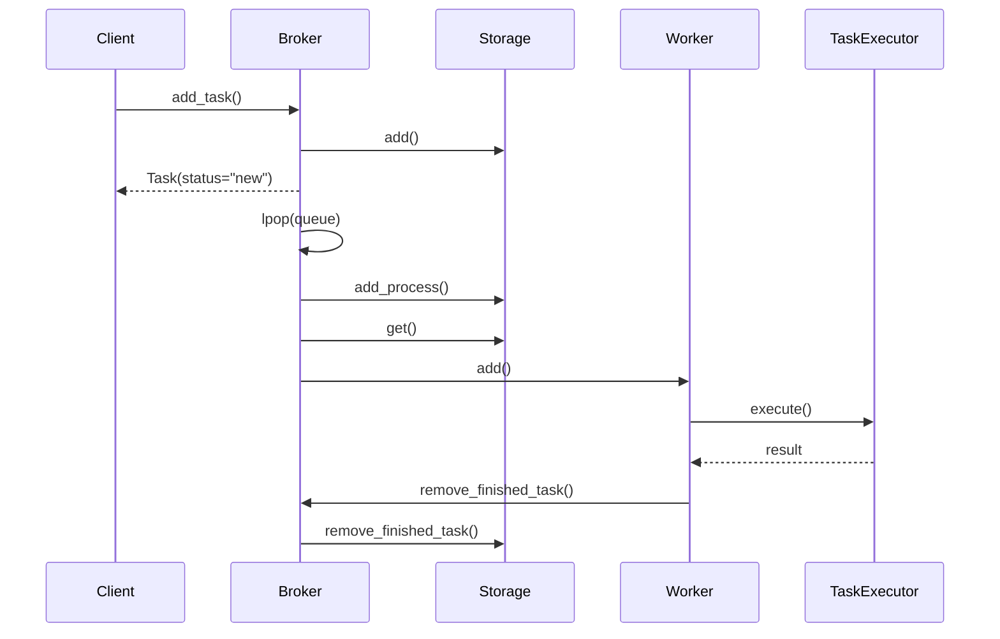

# Task Execution

This page describes the complete lifecycle of a task in QTasks: from the moment
it is sent by the client to the completion of execution on the server side and
the receipt of the result.
The description focuses on data flows, component contracts, and the order of interaction,
rather than on the user API.

The reference example uses a configuration with Redis as the broker and storage.

---

## General Component Interaction Diagram



The diagram reflects only the high-level order of interactions.
The details of each stage are disclosed below.

---

## Task submission by the client

On the client side, the task exists exclusively as a data schema
and is not linked to a specific method of execution.

1. The client sends the task to the Broker via the `add_task` contract, which is
internally translated into the `add` contract.
2. The Broker passes the task data to the Storage via the `add` contract.
3. The Storage serializes the task status and saves it, for example, for Redis:

   ```text
   hset("{storage_name}:{uuid}", mapping=task_status.__dict__)
   ```

4. The broker adds a reference to the task to its own queue:

   ```text
   rpush(queue_name, "{task_name}:{uuid}:{priority}")
   ```

5. The broker immediately returns the `Task` schema with the status `new` to the
client.

At this stage, the task is considered registered but not yet processed.

---

## Receiving a task by the server

A broker operating in server mode constantly polls the task queue.

1. The broker executes `lpop(queue_name)`.
1.1. If the queue is empty, the broker suspends execution for `default_sleep`
seconds (default `0.01`).
2. Upon receiving a task, the broker notifies the storage about the start of processing
according to the contract
`add_process`.
3. The Storage adds the task to the queue of tasks to be executed, for example:

   ```text
   zadd(queue_process, {task_data: priority})
   ```

4. The Broker requests the complete task data from the Storage using the `get` contract.
5. The received data is transferred to the Worker via the `add` contract.

---

## Execution queue in Worker

1. The Worker converts the received data into `TaskPrioritySchema`.
2. The schema is added to the internal execution queue `self.queue`.
3. The `new` task status is immediately generated and returned.
4. Subworkers running inside the Worker listen to one common queue.
5. Tasks are captured on a first-come, first-served basis using `Condition`
and `Semaphore(max_tasks_process)`.

Thus, parallelism and asynchrony are limited and controlled at the Worker level.

---

## Task transition to execution state

1. Before the actual launch, Worker forms `TaskStatusProcessSchema`.
2. The status is transferred to the Broker via the `update` contract.
3. The Broker transmits the update to the Storage:

```text
   hset("{storage_name}:{uuid}", mapping=asdict(model))
```

At this stage, the task is officially considered to be in progress.

---

## Task function execution

1. The worker retrieves the task description from `app._tasks` in the form of `TaskExecSchema`.
2. This schema is attached to the task data.
3. The worker passes the task to `TaskExecutor` via the `execute()` contract.

Sequence inside `TaskExecutor`:

* call `execute_middlewares_before()`;
* call `before_execute()`;
* execute `run_task()`;
* for a generator task, delegate to `run_task_gen()`;
* call `after_execute()`;
* call `execute_middlewares_after()`;
* application of `decode()` (if enabled, default is yes).

`TaskExecutor` returns either the result or an exception to the Worker.

---

## Task completion

Depending on the result, the Worker forms one of the final schemas:

* `TaskStatusSuccessSchema`;
* `TaskStatusErrorSchema`;
* `TaskStatusCancelSchema`.

1. The result is passed to `remove_finished_task()`.
2. The Worker sends the data to the Broker according to the `remove_finished_task()`
contract.
3. The Broker transfers it to the Storage.

The Storage performs two actions:

```text
hset("{storage_name}:{uuid}", mapping=model.__dict__)
zrem(queue_process, "{task_name}:{uuid}:{priority}")
```

---

## Redis command queue

When using Redis, write operations are performed via `(A)syncRedisCommandQueue`.

1. Commands are added to the internal execution queue.
2. If the queue does not exist, it is created automatically.
3. The queue is executed sequentially.
4. After the last command is executed, the queue is automatically closed.

This mechanism reduces overhead and organizes write operations.

---

## Getting the task result

The task status is obtained through the Storage.

1. According to the `get()` contract, data is retrieved and converted to `Task`.
2. If `timeout` is specified in `add_task()`, `(A)syncResult` is used.
3. `(A)syncResult` periodically queries the Storage at intervals of `result_time_interval`.
4. Waiting is implemented via:
   * `ThreadPoolExecutor(max_workers=1)` for sync mode;
   * `asyncio.wait_for()` for async mode.
5. If the task status is not included in `result_statuses_end`
(default: `SUCCESS`, `ERROR`, `CANCEL`), the wait continues.

After reaching the final status, the result is returned to the client.

---

## Architectural invariants

* The task is represented by data schemas at all stages, not by executable objects.
* Components interact exclusively through contracts.
* The broker does not execute tasks and does not know their internal logic.
* The worker does not manage data storage.
* The storage does not contain execution logic.

These invariants ensure predictable behavior and the ability to replace any
component without changing the others.
