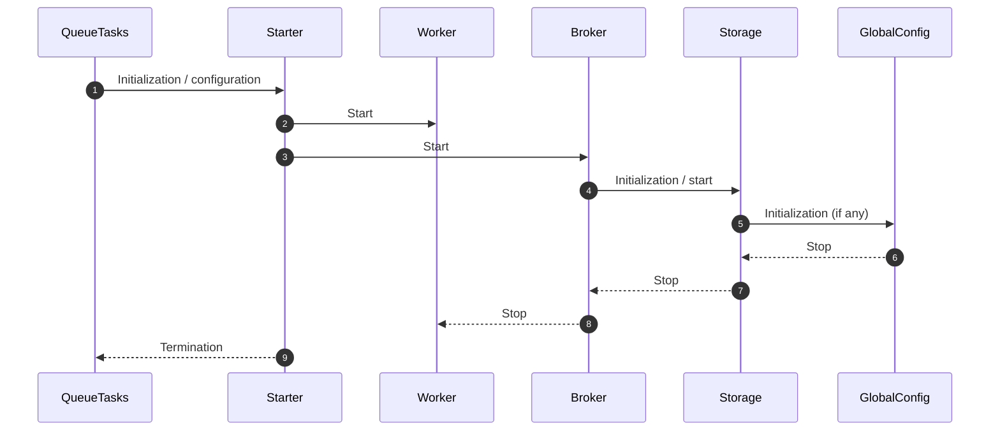
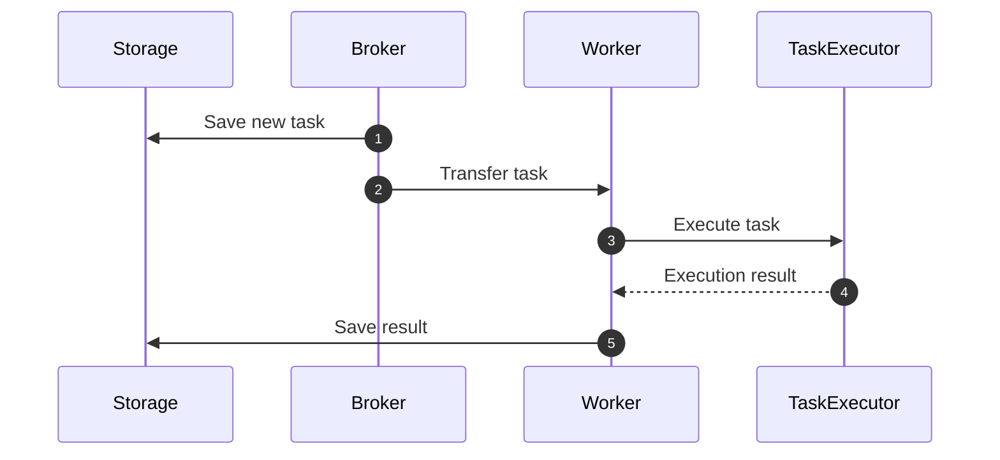
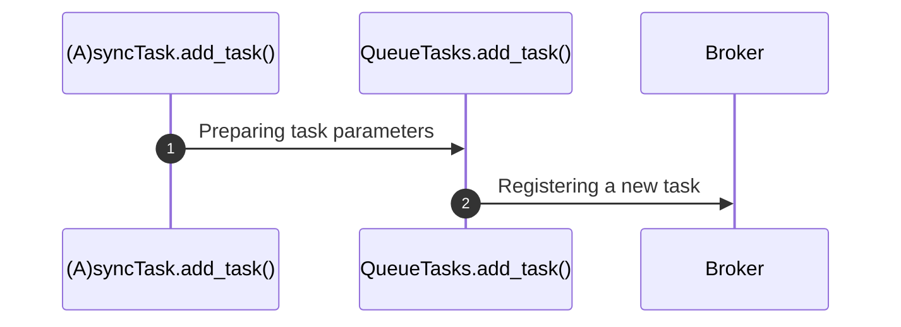
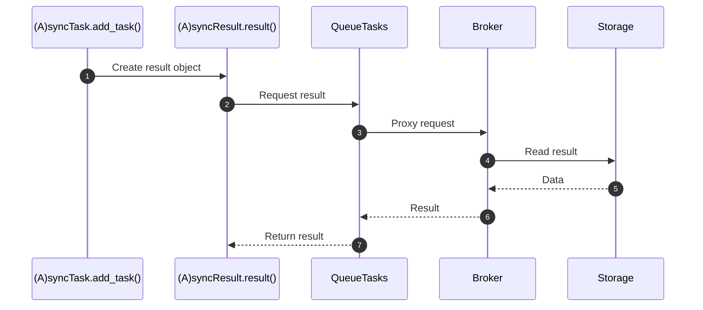

# Diagrams

## Background diagram of framework connections

This diagram shows the relationship between components and the correct startup order:

* Starter starts **only Worker and Broker**.
* Broker starts **Storage**.
* Storage starts **GlobalConfig**, if present.
* Shutdown occurs in reverse order.

---

## Task processing by the server

This diagram reflects the actual process:

1. The task is saved in Storage.
2. The broker transfers the task to the worker.
3. Worker calls TaskExecutor — a replaceable task execution component.
4. TaskExecutor executes the task function, calls middlewares_before/middlewares_after,
handles errors and retries.
5. The result is transferred to the worker and saved in Storage.

---

## Task creation by the client

The process looks like this:

1. `(A)syncTask.add_task()` or `TaskCls().__call__().add_task()` prepares
the parameters.
2. Internally, everything is translated to `QueueTasks.add_task()`.
3. The broker accepts the task and saves it via Storage.

---

## Receiving the task result by the client

Steps:

1. `(A)syncTask.add_task()` creates `(A)syncResult`.
2. `(A)syncResult.result()` calls `QueueTasks`, which proxies the request.
3. `QueueTasks.get()` is redirected to `Broker.get()`.
4. Broker requests data from Storage.
5. Storage returns the result.
6. The result is sent back through Broker → QueueTasks → (A)syncResult.
