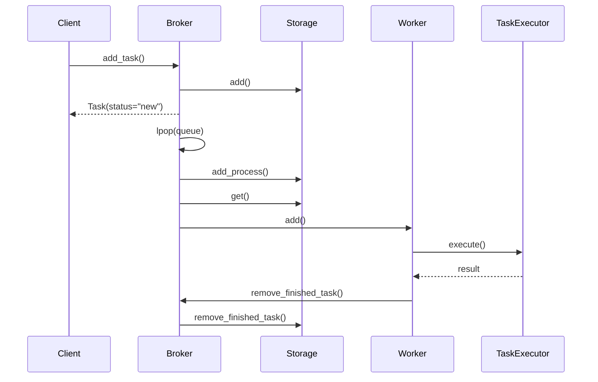

# Выполнение задач

Эта страница описывает полный жизненный цикл задачи в QTasks: от момента отправки
клиентом до завершения выполнения на стороне сервера и получения результата.
Описание сфокусировано на потоках данных, контрактах компонентов и порядке взаимодействия,
а не на пользовательском API.

В качестве опорного примера используется конфигурация с Redis в роли брокера и хранилища.

---

## Общая схема взаимодействия компонентов



Диаграмма отражает только верхнеуровневый порядок взаимодействий.
Детали каждого этапа раскрываются ниже.

---

## Отправка задачи клиентом

На стороне клиента задача существует исключительно в виде схемы данных
и не связана с конкретным способом выполнения.

1. Клиент отправляет задачу в Брокер по контракту `add_task`, который внутри
транслируется в контракт `add`.
2. Брокер передаёт данные задачи в Хранилище по контракту `add`.
3. Хранилище сериализует статус задачи и сохраняет его, например для Redis:

   ```text
   hset("{storage_name}:{uuid}", mapping=task_status.__dict__)
   ```

4. Брокер добавляет ссылку на задачу в собственную очередь:

   ```text
   rpush(queue_name, "{task_name}:{uuid}:{priority}")
   ```

5. Брокер немедленно возвращает клиенту схему `Task` со статусом `new`.

На этом этапе задача считается зарегистрированной, но ещё не взятой в обработку.

---

## Получение задачи сервером

Брокер, работающий в серверном режиме, постоянно опрашивает очередь задач.

1. Брокер выполняет `lpop(queue_name)`.
   1.1. Если очередь пуста, Брокер приостанавливает выполнение на `default_sleep`
   секунд (по умолчанию `0.01`).
2. При получении задачи Брокер уведомляет Хранилище о начале обработки по контракту
`add_process`.
3. Хранилище добавляет задачу в очередь выполняемых задач, например:

   ```text
   zadd(queue_process, {task_data: priority})
   ```

4. Брокер запрашивает полные данные задачи у Хранилища по контракту `get`.
5. Полученные данные передаются в Воркер по контракту `add`.

---

## Очередь выполнения в Worker

1. Воркер преобразует полученные данные в `TaskPrioritySchema`.
2. Схема добавляется во внутреннюю очередь выполнения `self.queue`.
3. Немедленно формируется и возвращается статус задачи `new`.
4. Сабворкеры, запущенные внутри Worker, слушают одну общую очередь.
5. Захват задачи происходит по принципу «кто первый взял» с использованием `Condition`
и `Semaphore(max_tasks_process)`.

Таким образом, параллелизм и асинхронность ограничиваются и контролируются на уровне
Worker.

---

## Переход задачи в состояние выполнения

1. Перед фактическим запуском Worker формирует `TaskStatusProcessSchema`.
2. Статус передаётся в Брокер по контракту `update`.
3. Брокер транслирует обновление в Хранилище:

   ```text
   hset("{storage_name}:{uuid}", mapping=asdict(model))
   ```

На этом этапе задача официально считается выполняемой.

---

## Выполнение функции задачи

1. Worker извлекает описание задачи из `app._tasks` в виде `TaskExecSchema`.
2. Эта схема присоединяется к данным задачи.
3. Worker передаёт задачу в `TaskExecutor` через контракт `execute()`.

Последовательность внутри `TaskExecutor`:

* вызов `execute_middlewares_before()`;
* вызов `before_execute()`;
* выполнение `run_task()`;
* при генераторной задаче — делегирование в `run_task_gen()`;
* вызов `after_execute()`;
* вызов `execute_middlewares_after()`;
* применение `decode()` (если включено, по умолчанию — да).

`TaskExecutor` возвращает в Worker либо результат, либо исключение.

---

## Завершение задачи

В зависимости от результата Worker формирует одну из финальных схем:

* `TaskStatusSuccessSchema`;
* `TaskStatusErrorSchema`;
* `TaskStatusCancelSchema`.

1. Результат передаётся в `remove_finished_task()`.
2. Worker отправляет данные в Брокер по контракту `remove_finished_task()`.
3. Брокер передаёт их в Хранилище.

Хранилище выполняет два действия:

```text
hset("{storage_name}:{uuid}", mapping=model.__dict__)
zrem(queue_process, "{task_name}:{uuid}:{priority}")
```

---

## Очередь команд Redis

При использовании Redis операции записи выполняются через `(A)syncRedisCommandQueue`.

1. Команды добавляются во внутреннюю очередь выполнения.
2. Если очередь отсутствует — она создаётся автоматически.
3. Очередь выполняется последовательно.
4. После выполнения последней команды очередь автоматически завершается.

Этот механизм снижает накладные расходы и упорядочивает операции записи.

---

## Получение результата задачи

Получение состояния задачи происходит через Хранилище.

1. По контракту `get()` данные извлекаются и преобразуются в `Task`.
2. Если при `add_task()` указан `timeout`, используется `(A)syncResult`.
3. `(A)syncResult` периодически запрашивает Хранилище с интервалом `result_time_interval`.
4. Ожидание реализуется через:

   * `ThreadPoolExecutor(max_workers=1)` для sync-режима;
   * `asyncio.wait_for()` для async-режима.
5. Если статус задачи не входит в `result_statuses_end`
(по умолчанию: `SUCCESS`, `ERROR`, `CANCEL`), ожидание продолжается.

После достижения конечного статуса результат возвращается клиенту.

---

## Архитектурные инварианты

* Задача на всех этапах представлена схемами данных, а не исполняемыми объектами.
* Компоненты взаимодействуют исключительно через контракты.
* Брокер не выполняет задачи и не знает их внутренней логики.
* Worker не управляет хранением данных.
* Хранилище не содержит логики выполнения.

Эти инварианты обеспечивают предсказуемость поведения и возможность замены любого
компонента без изменения остальных.
