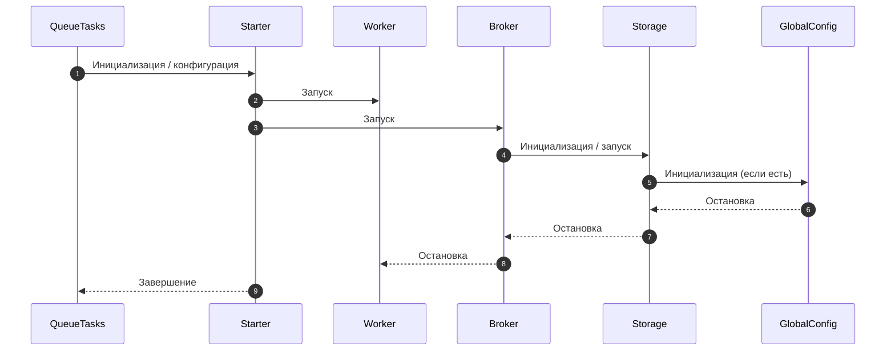
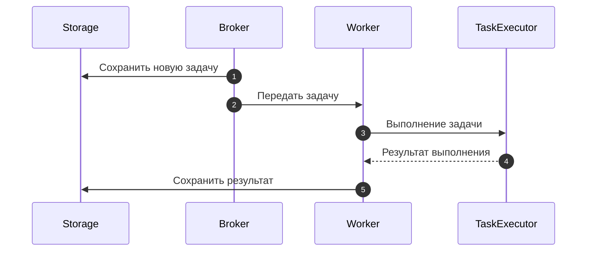
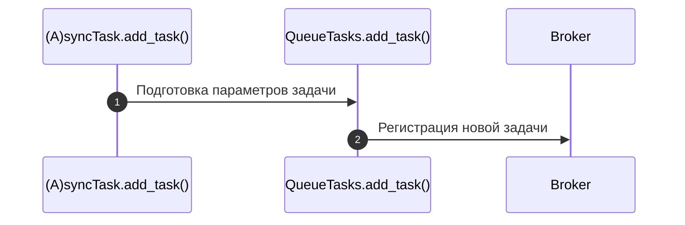
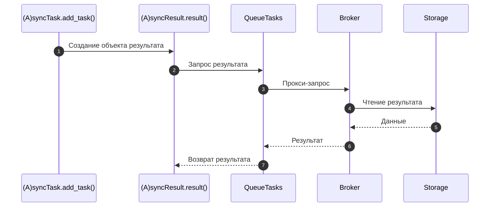

# Схемы

## Background-схема связей фреймворка

Эта диаграмма показывает связь компонентов и правильный порядок запуска:

* Starter запускает **только Worker и Broker**.
* Broker запускает **Storage**.
* Storage запускает **GlobalConfig**, если он присутствует.
* Остановка происходит в обратном порядке.

---

## Обработка задачи сервером

Эта диаграмма отражает фактический процесс:

1. Задача сохраняется в Storage.
2. Брокер передаёт задачу воркеру.
3. Worker вызывает TaskExecutor — заменяемый компонент выполнения задач.
4. TaskExecutor выполняет функцию задачи, вызывает middlewares_before/middlewares_after,
обрабатывает ошибки и retry.
5. Результат передаётся воркеру и сохраняется в Storage.

---

## Создание задачи клиентом

Процесс выглядит так:

1. `(A)syncTask.add_task()` или `TaskCls().__call__().add_task()` подготавливает
параметры.
2. Внутренне всё переводится на `QueueTasks.add_task()`.
3. Брокер принимает задачу и сохраняет её через Storage.

---

## Получение результата задачи клиентом

Этапы:

1. `(A)syncTask.add_task()` создаёт `(A)syncResult`.
2. `(A)syncResult.result()` вызывает `QueueTasks`, который проксирует запрос.
3. `QueueTasks.get()` перенаправляется в `Broker.get()`.
4. Broker запрашивает данные у Storage.
5. Storage возвращает результат.
6. Результат поднимается обратно через Broker → QueueTasks → (A)syncResult.
